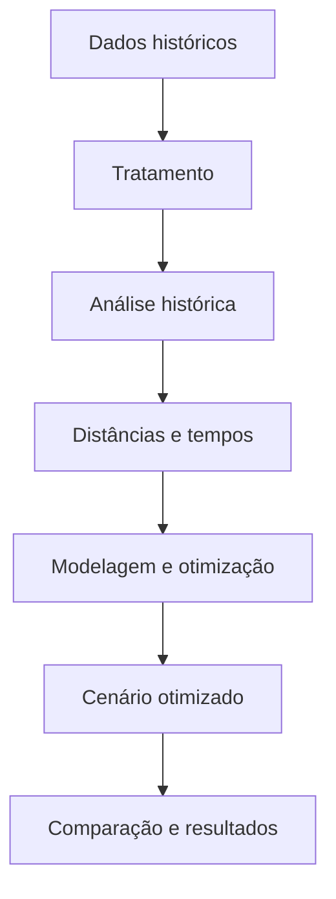

# 📌 SafeFlow — Otimização das Fiscalizações do IPEM-SP

Projeto desenvolvido no 3º semestre de Logística da Fatec São José dos Campos, no contexto da Aprendizagem por Projetos Integradores (API).

O SafeFlow utilizará dados históricos e Pesquisa Operacional para analisar e otimizar a distribuição das fiscalizações realizadas pela regional do IPEM-SP de São José dos Campos.

---

# 📑 Índice

- [Projeto](#projeto)
- [Equipe](#equipe)
- [Objetivo](#objetivo)
- [Questões para análise](#questoes)
- [Funcionalidades](#funcionalidades)
- [Requisitos](#requisitos)
- [Tecnologias](#tecnologias)
- [Backlog](#backlog)
- [Fluxo do projeto](#fluxo)
- [Sprints](#sprints)

---

# 📊 Projeto

O IPEM-SP fiscaliza instrumentos e equipamentos, como balanças e bombas de combustível. O projeto analisará os registros históricos dessas atividades e desenvolverá uma proposta para melhorar a distribuição das fiscalizações entre as equipes.

---

# 👥 Equipe

| Função | Nome | LinkedIn e GitHub |
|--------|------|-------------------|
| Product Owner | Ana Clara Dias | [LinkedIn](http://linkedin.com/in/ana-clara-dias-de-souza-927431179) \| [GitHub](https://github.com/AninhaDias) |
| Team Member | Kauan Souza | [LinkedIn](https://linkedin.com/in/kauan-souza-9247aa377) \| [GitHub](https://github.com/kauanzcsouza10-art) |
| Team Member | Davi Pais | [LinkedIn](https://linkedin.com/in/davi-pais-340989359) \| [GitHub](https://github.com/DaviPaisKitada) |
| Team Member | Mariana Leal | [LinkedIn](https://linkedin.com/in/mariana-leal-a708b8335) \| [GitHub](https://github.com/marileal071415-create) |

---

# 🎯 Objetivo

Desenvolver uma solução baseada em Pesquisa Operacional para:

- Analisar a operação histórica;
- Melhorar a distribuição das fiscalizações;
- Reduzir deslocamentos e tempo de viagem;
- Balancear a carga de trabalho;
- Comparar os cenários histórico e otimizado.

---

# ❓ Questões para Análise

1. Como as equipes foram distribuídas historicamente?
2. Quais municípios e tipos de fiscalização concentraram maior demanda?
3. Como a carga de trabalho foi distribuída entre as equipes?
4. Qual seria a melhor distribuição das fiscalizações?
5. Qual é a redução potencial de quilômetros e tempo de deslocamento?
6. Quais ganhos são identificados ao comparar os cenários histórico e otimizado?

---

# ⚙️ Funcionalidades

- 🗺️ Mapa das fiscalizações;
- 🚗 Rotas históricas e otimizadas;
- 📊 Dashboard de indicadores;
- 🔄 Simulação de cenários;
- 📄 Exportação de relatórios.

---

# 📋 Requisitos

| Código | Requisito |
|--------|-----------|
| RN.P.1 | Tratar e padronizar os dados históricos |
| RN.P.2 | Analisar a operação histórica |
| RN.P.3 | Construir a matriz de distâncias e tempos |
| RN.P.4 | Modelar o problema de otimização |
| RN.P.5 | Implementar o modelo em Python |
| RN.P.6 | Construir o cenário otimizado |
| RN.P.7 | Comparar os cenários e calcular indicadores |
| RN.P.8 | Desenvolver o dashboard e o relatório técnico |

---

# 🛠 Tecnologias Previstas

- **Python e Pandas** — tratamento e análise dos dados;
- **OR-Tools ou Pyomo** — implementação do modelo de otimização;
- **BI** — visualização dos indicadores;
- **GitHub** — versionamento e documentação;
- **Office** — apresentações e relatório técnico.

> Outras tecnologias poderão ser adicionadas conforme a evolução do projeto.

---

# 🗂 Backlog do Produto

O backlog foi estruturado em 20 questões centrais, divididas igualmente entre a análise histórica e a otimização da operação.

A primeira etapa busca compreender como as fiscalizações foram realizadas. A segunda utiliza os resultados históricos para propor, simular e avaliar uma distribuição otimizada das atividades.

## 📊 Análise do histórico

| Rank | Prioridade | Pergunta | User Story | Estimativa | Sprint |
|-----:|------------|----------|------------|------------|--------|
| 1 | Alta | Como preparar e validar a base histórica para análise? | Como analista, quero tratar, padronizar e validar os dados, diferenciando instrumentos, visitas e roteiros, para garantir resultados confiáveis. | [DEFINIR] | [DEFINIR] |
| 2 | Alta | Como fiscais e motoristas foram distribuídos historicamente? | Como gestor, quero visualizar a formação das equipes e os roteiros realizados para compreender como os profissionais foram distribuídos. | [DEFINIR] | [DEFINIR] |
| 3 | Alta | Como a carga de trabalho foi distribuída entre as equipes? | Como gestor, quero comparar roteiros, visitas e instrumentos por equipe para identificar sobrecarga ou subutilização. | [DEFINIR] | [DEFINIR] |
| 4 | Alta | Quais municípios concentraram a maior demanda? | Como planejador, quero analisar visitas e instrumentos por município para identificar a concentração territorial das fiscalizações. | [DEFINIR] | [DEFINIR] |
| 5 | Alta | Quais serviços e tipos de instrumento foram mais frequentes? | Como analista, quero classificar os registros por serviço, espécie e item para compreender o perfil técnico da demanda. | [DEFINIR] | [DEFINIR] |
| 6 | Alta | Quais resultados e irregularidades foram encontrados nas fiscalizações? | Como gestor, quero analisar aprovações, reprovações, interdições e verificações não realizadas por município e tipo de instrumento. | [DEFINIR] | [DEFINIR] |
| 7 | Alta | Como a demanda variou ao longo do período analisado? | Como analista, quero comparar meses, dias da semana e estabelecimentos revisitados para identificar padrões temporais e recorrências. | [DEFINIR] | [DEFINIR] |
| 8 | Alta | Qual foi o perfil dos roteiros históricos? | Como planejador, quero analisar a quantidade de endereços, instrumentos e o intervalo operacional de cada roteiro para compreender sua configuração. | [DEFINIR] | [DEFINIR] |
| 9 | Alta | Quais indicadores representam o desempenho da operação histórica? | Como gestor, quero acompanhar indicadores de equipes, demanda, carga e resultados para avaliar o cenário histórico. | [DEFINIR] | [DEFINIR] |
| 10 | Média | Como visualizar e disponibilizar os resultados da análise histórica? | Como usuário, quero consultar um dashboard com filtros e exportar os resultados para apoiar análises, apresentações e decisões. | [DEFINIR] | [DEFINIR] |

## 🧮 Otimização da operação

| Rank | Prioridade | Pergunta | User Story | Estimativa | Sprint |
|-----:|------------|----------|------------|------------|--------|
| 11 | Alta | Como representar geograficamente os pontos de fiscalização? | Como analista, quero geocodificar os endereços e visualizá-los em um mapa para compreender sua distribuição territorial. | [DEFINIR] | [DEFINIR] |
| 12 | Alta | Como calcular as distâncias e os tempos entre os pontos? | Como planejador, quero construir uma matriz considerando fiscalizações e bases operacionais para calcular os deslocamentos. | [DEFINIR] | [DEFINIR] |
| 13 | Alta | Quais capacidades e restrições operacionais devem ser consideradas? | Como gestor, quero definir jornadas, bases, disponibilidade, especializações e limites das equipes para garantir soluções viáveis. | [DEFINIR] | [DEFINIR] |
| 14 | Alta | Como representar matematicamente o problema de otimização? | Como planejador, quero definir objetivos, variáveis e restrições para formular o problema em Pesquisa Operacional. | [DEFINIR] | [DEFINIR] |
| 15 | Alta | Como implementar e validar o modelo de otimização? | Como desenvolvedor, quero implementar o modelo em Python e testar seus resultados para gerar soluções consistentes. | [DEFINIR] | [DEFINIR] |
| 16 | Alta | Qual é a melhor distribuição das fiscalizações entre as equipes? | Como planejador, quero agrupar e distribuir as fiscalizações para reduzir deslocamentos e melhorar a utilização das equipes. | [DEFINIR] | [DEFINIR] |
| 17 | Alta | Qual é a melhor sequência de visitas para cada equipe? | Como planejador, quero gerar roteiros otimizados para reduzir quilômetros e tempo de deslocamento. | [DEFINIR] | [DEFINIR] |
| 18 | Alta | Como equilibrar a carga de trabalho no cenário otimizado? | Como gestor, quero distribuir as atividades considerando visitas, instrumentos, tempo e deslocamento para evitar desequilíbrios. | [DEFINIR] | [DEFINIR] |
| 19 | Média | Como diferentes cenários afetam o planejamento das equipes? | Como planejador, quero simular mudanças na quantidade de equipes, capacidade e restrições para avaliar alternativas operacionais. | [DEFINIR] | [DEFINIR] |
| 20 | Alta | Quais ganhos são obtidos ao comparar os cenários histórico e otimizado? | Como gestor, quero comparar distância, tempo, carga, cobertura e atendimentos para avaliar os benefícios e as limitações da otimização. | [DEFINIR] | [DEFINIR] |

---

> As perguntas relacionadas às rotas, distâncias e tempos dependerão da geocodificação dos endereços, da construção da matriz de deslocamentos e da validação das restrições operacionais com o cliente.

# 📈 Indicadores Iniciais

- Quantidade de roteiros, visitas e instrumentos;
- Fiscalizações por equipe e município;
- Fiscalizações por tipo e resultado;
- Distribuição da carga de trabalho;
- Quilômetros e tempo de deslocamento;
- Comparação entre os cenários histórico e otimizado.

---

# 🔄 Fluxo Geral do Projeto

---

# 📅 Registro das Sprints

| Entrega | Previsão | Status | Histórico |
|---------|----------|--------|-----------|
| Vídeo de entendimento do problema | 04/09/2026 | Entregue | [Vídeo](https://www.youtube.com/watch?v=mzAqFt83a5Y) |
| Sprint 01 / Entrega 1 | 02/10/2026 | Não iniciada | [MVP](sp1.md) |
| Sprint 02 / Entrega 2 | 30/10/2026 | Não iniciada | [MVP](sp2.md) |
| Sprint 03 / Entrega 3 + vídeo | 27/11/2026 | Não iniciada | [MVP](sp3.md) |
| Feira de Soluções | 03/12/2026 | Não iniciada | — |

---

# 📝 Observação

As restrições operacionais, a composição das equipes e os critérios do modelo serão detalhados durante as próximas etapas, conforme a validação com o IPEM-SP.
