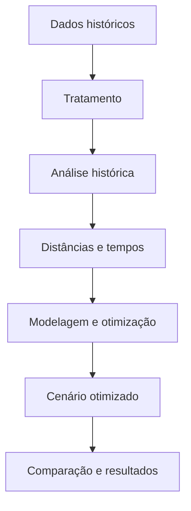

# 📌 SafeFlow — Otimização das Fiscalizações do IPEM-SP

Projeto desenvolvido no 3º semestre de Logística da Fatec São José dos Campos, no contexto da Aprendizagem por Projetos Integradores (API).

O SafeFlow utilizará dados históricos e Pesquisa Operacional para analisar e otimizar a distribuição das fiscalizações realizadas pela regional do IPEM-SP de São José dos Campos.

---

# 📑 Índice

- [Projeto](#projeto)
- [Equipe](#equipe)
- [Objetivo](#objetivo)
- [Questões para análise](#questoes)
- [Funcionalidades](#funcionalidades)
- [Requisitos](#requisitos)
- [Tecnologias](#tecnologias)
- [Backlog](#backlog)
- [Fluxo do projeto](#fluxo)
- [Sprints](#sprints)

---

# 📊 Projeto

O IPEM-SP fiscaliza instrumentos e equipamentos, como balanças e bombas de combustível. O projeto analisará os registros históricos dessas atividades e desenvolverá uma proposta para melhorar a distribuição das fiscalizações entre as equipes.

---

# 👥 Equipe

| Função | Nome | LinkedIn e GitHub |
|--------|------|-------------------|
| Product Owner | Ana Clara Dias | [LinkedIn](http://linkedin.com/in/ana-clara-dias-de-souza-927431179) \| [GitHub](https://github.com/AninhaDias) |
| Team Member | Kauan Souza | [LinkedIn](https://linkedin.com/in/kauan-souza-9247aa377) \| [GitHub](https://github.com/kauanzcsouza10-art) |
| Team Member | Davi Pais | [LinkedIn](https://linkedin.com/in/davi-pais-340989359) \| [GitHub](https://github.com/DaviPaisKitada) |
| Team Member | Mariana Leal | [LinkedIn](https://linkedin.com/in/mariana-leal-a708b8335) \| [GitHub](https://github.com/marileal071415-create) |

---

# 🎯 Objetivo

Desenvolver uma solução baseada em Pesquisa Operacional para:

- Analisar a operação histórica;
- Melhorar a distribuição das fiscalizações;
- Reduzir deslocamentos e tempo de viagem;
- Balancear a carga de trabalho;
- Comparar os cenários histórico e otimizado.

---

# ❓ Questões para Análise

1. Como as equipes foram distribuídas historicamente?
2. Quais municípios e tipos de fiscalização concentraram maior demanda?
3. Como a carga de trabalho foi distribuída entre as equipes?
4. Qual seria a melhor distribuição das fiscalizações?
5. Qual é a redução potencial de quilômetros e tempo de deslocamento?
6. Quais ganhos são identificados ao comparar os cenários histórico e otimizado?

---

# ⚙️ Funcionalidades

- 🗺️ Mapa das fiscalizações;
- 🚗 Rotas históricas e otimizadas;
- 📊 Dashboard de indicadores;
- 🔄 Simulação de cenários;
- 📄 Exportação de relatórios.

---

# 📋 Requisitos

| Código | Requisito |
|--------|-----------|
| RN.P.1 | Tratar e padronizar os dados históricos |
| RN.P.2 | Analisar a operação histórica |
| RN.P.3 | Construir a matriz de distâncias e tempos |
| RN.P.4 | Modelar o problema de otimização |
| RN.P.5 | Implementar o modelo em Python |
| RN.P.6 | Construir o cenário otimizado |
| RN.P.7 | Comparar os cenários e calcular indicadores |
| RN.P.8 | Desenvolver o dashboard e o relatório técnico |

---

# 🛠 Tecnologias Previstas

- **Python e Pandas** — tratamento e análise dos dados;
- **OR-Tools ou Pyomo** — implementação do modelo de otimização;
- **BI** — visualização dos indicadores;
- **GitHub** — versionamento e documentação;
- **Office** — apresentações e relatório técnico.

> Outras tecnologias poderão ser adicionadas conforme a evolução do projeto.

---

# 🗂 Backlog do Produto

| Rank | Prioridade | Pergunta | User Story | Estimativa | Sprint |
|-----:|------------|----------|------------|------------|--------|
| 1 | Alta | Como preparar a base histórica para análise? | Como analista, quero tratar e padronizar os dados para garantir análises confiáveis. | [DEFINIR] | [DEFINIR] |
| 2 | Alta | Como as equipes foram distribuídas historicamente? | Como analista, quero visualizar a distribuição das equipes para compreender a operação realizada. | [DEFINIR] | [DEFINIR] |
| 3 | Alta | Onde está concentrada a demanda? | Como gestor, quero analisar municípios e tipos de fiscalização para identificar as maiores demandas. | [DEFINIR] | [DEFINIR] |
| 4 | Alta | Como a carga de trabalho foi distribuída? | Como gestor, quero comparar a carga das equipes para identificar possíveis desequilíbrios. | [DEFINIR] | [DEFINIR] |
| 5 | Alta | Como visualizar geograficamente as fiscalizações? | Como analista, quero visualizar as fiscalizações em um mapa para compreender sua distribuição territorial. | [DEFINIR] | [DEFINIR] |
| 6 | Alta | Quais são as distâncias e os tempos entre os pontos? | Como planejador, quero construir uma matriz de deslocamentos para viabilizar a otimização. | [DEFINIR] | [DEFINIR] |
| 7 | Alta | Qual é a melhor distribuição das fiscalizações? | Como planejador, quero otimizar a distribuição para melhorar a utilização das equipes. | [DEFINIR] | [DEFINIR] |
| 8 | Alta | Como comparar as rotas históricas e otimizadas? | Como planejador, quero comparar os roteiros para avaliar a redução de distância e tempo. | [DEFINIR] | [DEFINIR] |
| 9 | Alta | Quais indicadores demonstram o desempenho? | Como gestor, quero acompanhar indicadores para avaliar os dois cenários. | [DEFINIR] | [DEFINIR] |
| 10 | Média | Como diferentes cenários afetam o planejamento? | Como planejador, quero simular cenários para analisar diferentes possibilidades de operação. | [DEFINIR] | [DEFINIR] |
| 11 | Média | Como disponibilizar os resultados? | Como usuário, quero exportar relatórios para consultar e compartilhar as análises. | [DEFINIR] | [DEFINIR] |

---

# 📈 Indicadores Iniciais

- Quantidade de roteiros, visitas e instrumentos;
- Fiscalizações por equipe e município;
- Fiscalizações por tipo e resultado;
- Distribuição da carga de trabalho;
- Quilômetros e tempo de deslocamento;
- Comparação entre os cenários histórico e otimizado.

---

# 🔄 Fluxo Geral do Projeto

---

# 📅 Registro das Sprints

| Entrega | Previsão | Status | Histórico |
|---------|----------|--------|-----------|
| Vídeo de entendimento do problema | 04/09/2026 | Entregue | [Vídeo](https://www.youtube.com/watch?v=mzAqFt83a5Y) |
| Sprint 01 / Entrega 1 | 02/10/2026 | Não iniciada | [MVP](sp1.md) |
| Sprint 02 / Entrega 2 | 30/10/2026 | Não iniciada | [MVP](sp2.md) |
| Sprint 03 / Entrega 3 + vídeo | 27/11/2026 | Não iniciada | [MVP](sp3.md) |
| Feira de Soluções | 03/12/2026 | Não iniciada | — |

---

# 📝 Observação

As restrições operacionais, a composição das equipes e os critérios do modelo serão detalhados durante as próximas etapas, conforme a validação com o IPEM-SP.
